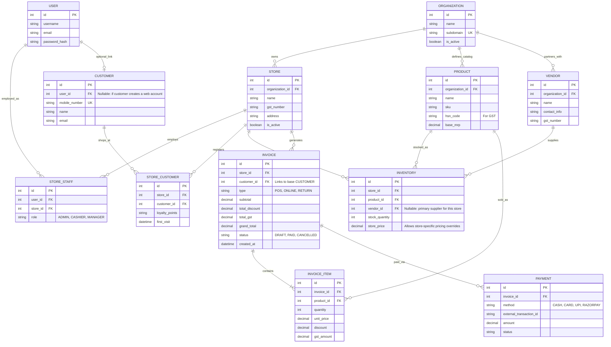

# Multi-Tenant ERP & POS Architecture

Based on your design requirements, this architecture natively supports a multi-tenant SaaS model where **Organizations** have multiple **Stores**, and Users/Customers are mapped relationally.

## Entity Relationship Diagram (ERD)

## Django Model Breakdown & Design Decisions

1. **`Organization` -> `Store` Hierarchy**
   - **`Organization`**: The top-level tenant. 
   - **`Store`**: A specific location/branch belonging to an organization.

2. **Decoupled Identity Models (`Users`, `Customers`, `Staff`)**
   - **`User`**: Global system auth identity (Django's built-in or custom AbstractUser).
   - **`StoreStaff`**: Maps a global `User` to a specific `Store` with a `role` (e.g., Cashier). A user could theoretically be staff across multiple stores.
   - **`Customer`**: A global identity record, keyed heavily by `mobile_number`. It has an optional One-to-One link to `User` (if the customer creates an account to log into the online storefront).
   - **`StoreCustomer`**: A mapping table linking a `Customer` to a `Store`. This allows a single customer (by mobile number) to be mapped to multiple stores across different orgs, while isolating store-specific data like loyalty points and visit history.

3. **Product & Inventory Strategy**
   - **`Product`**: Resides at the `Organization` level. This acts as the centralized catalog (Master Data).
   - **`Vendor`**: Resides at the `Organization` level. 
   - **`Inventory`**: Resides at the `Store` level. Links a `Product` to a `Store`, tracking local `stock_quantity`, optionally overriding the price for that specific store (`store_price`), and tracking which `Vendor` supplied that local stock.

4. **Transactional (`Invoice`, `InvoiceItem`, `Payment`)**
   - **`Invoice`**: Tied directly to a `Store` and a `Customer`. Captures POS transactions vs Online Orders via the `type` field.
   - **`InvoiceItem`**: Locks in the `unit_price`, `discount`, and `gst_amount` at the exact time of sale to ensure historical accuracy, even if the base product price changes later.
   - **`Payment`**: Supports tracking partial or multiple payments against a single invoice (e.g., split payment between Cash and Razorpay/UPI).

## Next Steps
Does this perfectly capture the data flow you envision? If so, we can consider this Architecture complete. 
Our next step would be breaking this into technical Plane tasks (e.g., "Implement User & Staff Models", "Implement Tenant & Catalog Models") and actually generating the Django `models.py`!
